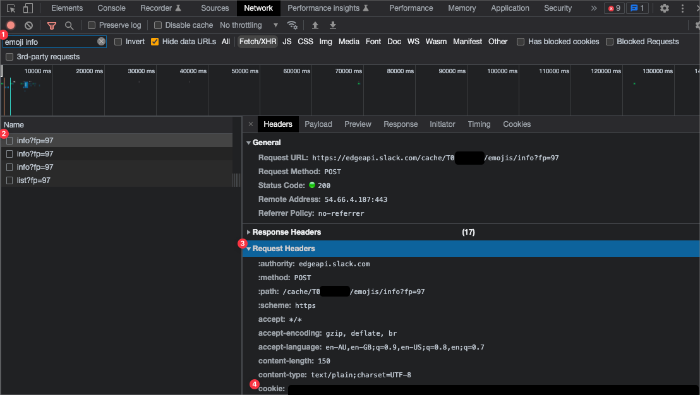

# Slack Emoji Fetcher

A small utility that allows you to download all the custom emojis you've spent years collecting and sharing across your favourite Slack workspaces.

### Why?

There is a non-zero number of times I've left a gig and wanted to take my emojis with me so I could share them with new coworkers. There is also a non-zero number of times I've been asked by _former_ coworkers to send them all our custom emojis for the same reason.

I am lazy and this utility makes the process incredibly simple.

## Requirements

Before you begin using `slack-emoji-fetcher`, you will need the following:

1. [jq](https://stedolan.github.io/jq/)
2. Bash version 4, or higher.
3. A target Slack workspace, or team, id.
4. Your Slack session cookie.
5. A request token so the fetcher can make API requests on your behalf.

The following steps will require you open your target Slack workspace in a browser. Chrom(e|ium) is assumed here.
### Getting the Id

Every team on Slack as a unique identifier. You can find it in your browser's address bar:


Between `client/` and `/CXXXXXX`.

### Getting the Cookie
In the same tab, access Chrome's "Developer Tools":
1. Select the "Network" tab.
2. In the filter field, add "emoji info". It'll narrow the request list down.
3. Select the first result; `info?fp=97`.
4. Click on the "Request Headers" section in the request details section.
5. In the `cookie` header, search for the entry named `d`. This is a big block of text, so you'll have to do some searching.


### Getting the Token
In the detail section of the same request, click on the "Payload" tab. Under the "Request Payload" section, you will see a JSON object. Within the object is a key named `token`. Save the associated value.


## Installation

The command is completely self-contained in a single Bash script. Drop it in your system's `$PATH` and you're good to go. In the following example, we're saving it directly to `/usr/local/bin/slack-emoji-fetcher`:

```bash
$ curl -s https://raw.githubusercontent.com/wilhelm-murdoch/slack-emoji-fetcher/main/slack-emoji-fetcher > /usr/local/bin/slack-emoji-fetcher
$ chmod a+x /usr/local/bin/slack-emoji-fetcher 
$ slack-emoji-fetcher --version
1.0.0
```

## Usage

Once you've found your team id, session cookie and request token (see [Requirements](#requirements) above) you should be able to run the following command:
```
$ slack-emoji-fetcher --workspace-id=*** --token=*** --cookie=***
[INF] saving :custom-one: to ./custom-one.png...done!
[INF] saving :custom-two: to ./custom-two.png...done!
[INF] saving :custom-three: to ./custom-three.png...done!
[INF] saving :custom-four: to ./custom-four.png...done!
[INF] saving :custom-five: to ./custom-five.png...done!
[INF] all done; exiting ...
```
This will save your custom emojis within the current directory. There are a few other flags and arguments you can play with if you need to troubleshoot or specify a different save location:
```
$ slack-emoji-fetcher --help
slack-emoji-fetcher - Download custom emojis from any Slack workspace.

Usage:
  slack-emoji-fetcher [options]
  slack-emoji-fetcher --help | -h
  slack-emoji-fetcher --version | -v

Options:
  --help, -h
    Show this help

  --version, -v
    Show version number

  --workspace-id ID (required)
    The unique identifier for your Slack workspace.

  --token TOKEN (required)
    The unique token associated with the API requests for the target Slack
    workspace.

  --cookie COOKIE (required)
    The value of the "d" cookie header used to authenticate with the target
    Slack workspace.

  --count COUNT
    The number of results to page through at a time.
    Default: 10

  --destination DESTINATION
    The directory in which emojis will be saved.
    Default: .

  --dry-run
    Queries the emoji endpoint, but does not save the results to disk.

  --debug
    Use to `set -x` for Bash while also activating high verbosity for curl
    commands. Useful for troubleshooting requests.

Examples:
  slack-emoji-fetcher --workspace-id=XXX --token=XXX --cookie=XXX
  slack-emoji-fetcher --workspace-id=XXX --token=XXX --cookie=XXX --debug --dry-run
  slack-emoji-fetcher --workspace-id=XXX --token=XXX --cookie=XXX --count=100 --destination="${HOME}/Downloads/emojis" --dry-run
```
    
## Building & Contributing

This tool is written in Bash, but built with [Bashly](https://bashly.dannyb.co/). Perform the following steps to begin developing locally:

1. Install Bashly locally with `gem install bashly`.
2. Clone this repository with `git@github.com:wilhelm-murdoch/slack-emoji-fetcher.git`.
3. Modify the tool's command configuration in `src/bashly.yml`.
4. Run `bashly g` from the root of this project to stub out any new commands or update any help documentation.
5. Start coding your new command from the stubbed Bash script in `src/*_command.sh`.
6. Run `bashly g` every time you wish to test your progress as Bashly consolidates all changes to the `slack-emoji-fetcher` script located at the root of this project.

Contributions are always welcome. Just create a PR and remember to be nice.
## Acknowledgements

This stupid little tool couldn't be possible without the following projects:

 - [jq](https://stedolan.github.io/jq/)
 - [Bashly](https://bashly.dannyb.co/)
 - [readme.so](https://readme.so/)

## License

[Unlicense](https://choosealicense.com/licenses/unlicense/)

  